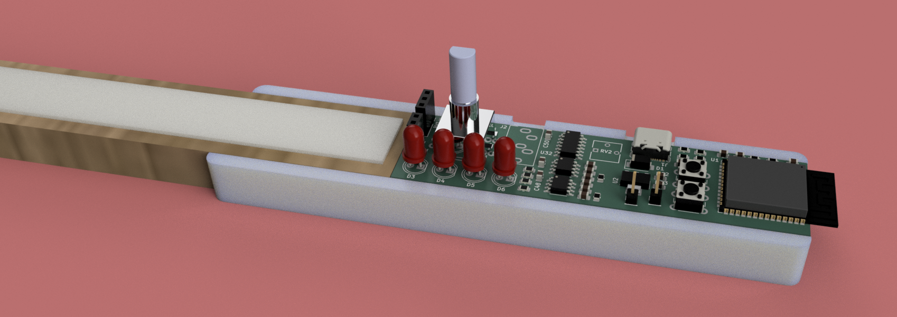
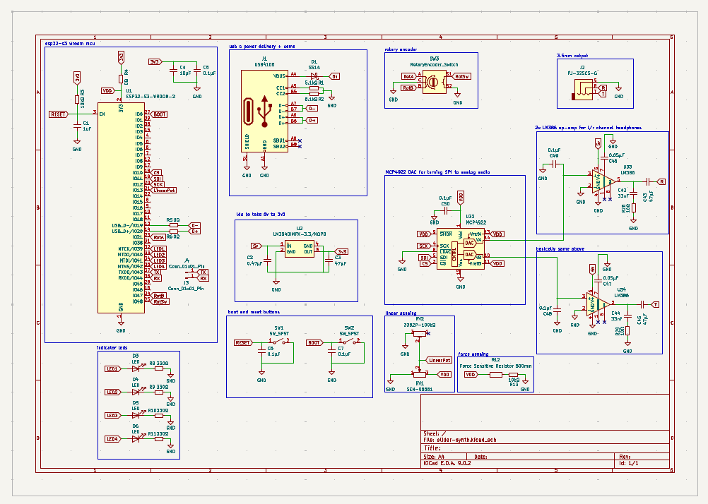

# Slider Synth

A synth that is inspired by the modulin by wintergatan. It uses the esp32 and mozzi library to output sound.

## Purpose

I built this pcb to make my diy setup more professional. I originally hooked everything up with an arduino but was really hard to cary around without dropping the breadboard or unplugging something. This design leaves it hot pluggable as well as super professional and more polished. 

## Schematic

## Additional Notes

[rotary encoder model](https://github.com/KiCad/kicad-packages3D/issues/547)

[sot-223 model](https://grabcad.com/library/discrete-smd-1/details?folder_id=1300113)

## BOM

| Price  | Part Number            | Type     | LCSC Part   | Owner    | Designators          |   Qty | Manufacturer   |
|:-------|:-----------------------|:---------|:------------|:---------|:---------------------|------:|:---------------|
| $0.02  | CL21A106KAYNNNE        | Basic    | C15850      | System   | C4                   |     2 | JLCPCB         |
| $0.17  | CL21A476MQYNNNE        | Basic    | C16780      | System   | C3,C43,C45           |     6 | JLCPCB         |
| $0.03  | SS14                   | Basic    | C2480       | System   | D1                   |     2 | JLCPCB         |
| $0.02  | CL21B105KBFNNNE        | Basic    | C28323      | System   | C1                   |     2 | JLCPCB         |
| $2.11  | LM3940IMPX-3.3/NOPB    | Extended | C544820     | System   | U2                   |     2 | JLCPCB         |
| $0.05  | CC0805KRX7R9BB104      | Basic    | C49678      | System   | C48,C49,C5,C50,C6,C7 |    12 | JLCPCB         |
| $0.37  | LM386                  | Extended | C5157706    | System   | U33,U34              |     4 | JLCPCB         |
| $0.03  | CL21B474KBFNNNE        | Basic    | C13967      | System   | C2                   |     2 | JLCPCB         |
| $0.01  | 0805W8F0000T5E         | Basic    | C17477      | System   | R4,R5,R6             |     6 | JLCPCB         |
| $5.35  | MCP4922-E/SL           | Extended | C39851      | System   | U32                  |     2 | JLCPCB         |
| $0.01  | 0805W8F1002T5E         | Basic    | C17414      | System   | R13,R3               |     4 | JLCPCB         |
| $0.01  | 0805W8F100JT5E         | Basic    | C17415      | System   | R28,R29              |     4 | JLCPCB         |
| $2.24  | USB4105-GF-A-120       | Extended | C5184243    | System   | J1                   |     2 | JLCPCB         |
| $0.03  | 0805B333K500NT         | Basic    | C1739       | System   | C42,C44              |     4 | JLCPCB         |
| $0.01  | 0805W8F3300T5E         | Basic    | C17630      | System   | R10,R11,R8,R9        |     8 | JLCPCB         |
| $0.05  | CL21B473KBCNNNC        | Basic    | C53134      | Customer | C46,C47              |     4 | JLCPCB         |
| $0.01  | 0805W8F5101T5E         | Basic    | C27834      | System   | R1,R2                |     4 | JLCPCB         |
| $23.28 | **Total Part Price**   |          |             |          |                      |       |                |
|        |                        |          |             |          |                      |       |                |
| $37.24 | Merchandise Total      |          |             |          |                      |       |                |
| $26.56 | Shipping Estimate      |          |             |          |                      |       |                |
| $5.27  | Sales Tax              |          |             |          |                      |       |                |
| $20.49 | Customs duties & taxes |          |             |          |                      |       |                |
| $89.56 | **Grand Total**        |          |             |          |                      |       |                |

I am supplying my own esp32-s3, rotary encoder, buttons, leds, and some other stuff that would cause the price to spike up to $30
